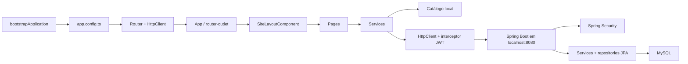
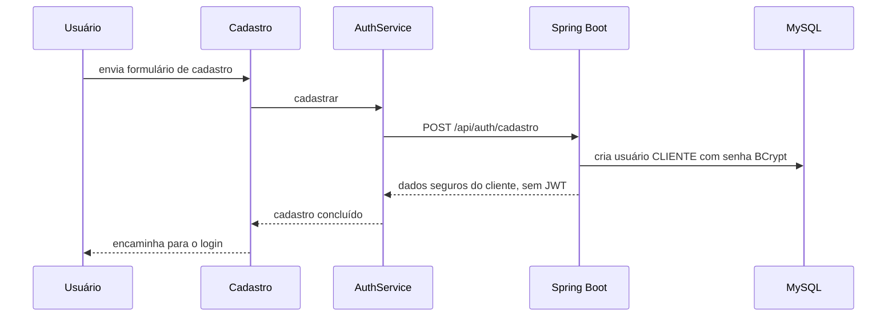
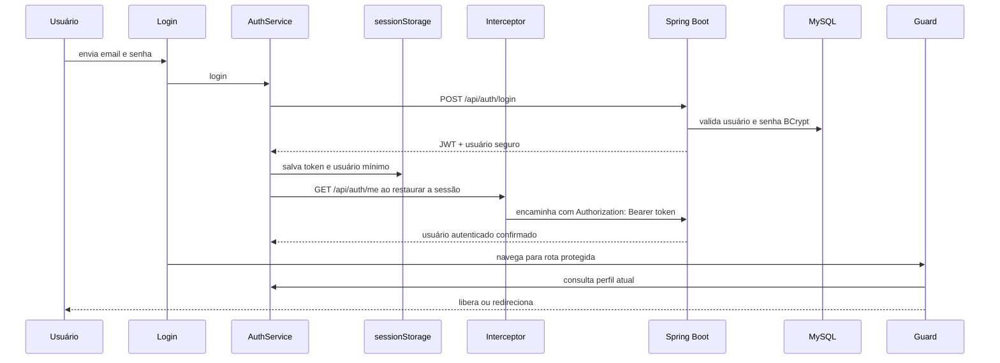
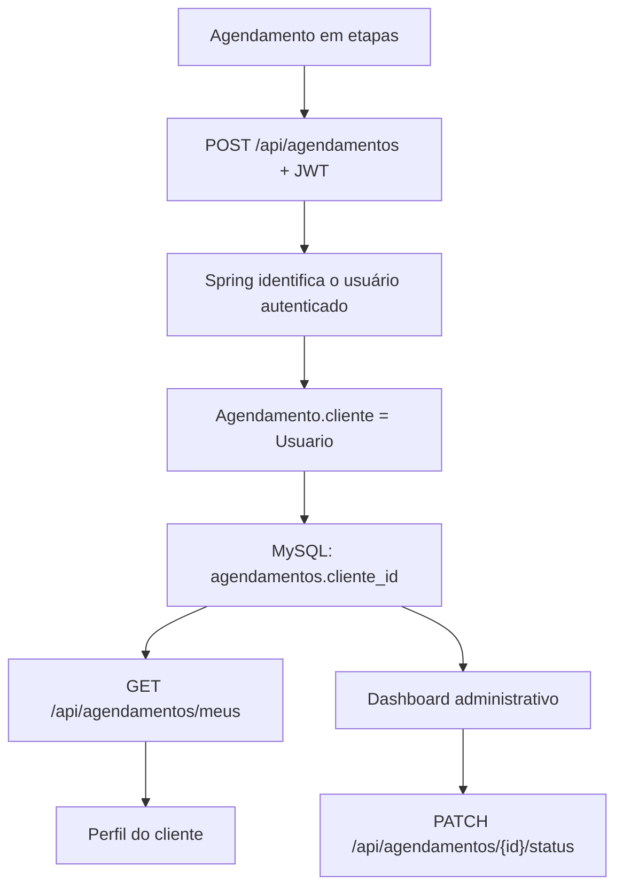
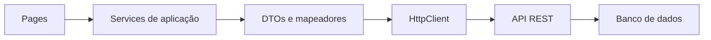

# Arquitetura do Code Ink

Atualizado em 17/08/2026 com base no frontend Angular e no backend Spring Boot presentes neste repositório.

## Escopo confirmado

O Code Ink reúne dois módulos no mesmo repositório:

- `PI_/`: frontend Angular standalone;
- `burger/`: backend Spring Boot conectado ao MySQL.

A arquitetura operacional combina dados demonstrativos para o catálogo com integração real para autenticação e agendamentos. O frontend usa `sessionStorage` para manter o token e o usuário mínimo da sessão; usuários e agendamentos são persistidos pelo backend no MySQL.

## Visão geral



`provideHttpClient(withInterceptors(...))` registra o cliente HTTP e o interceptor JWT. `provideAppInitializer()` restaura a sessão consultando `GET /api/auth/me` antes de concluir a inicialização.

## Inicialização

1. `src/main.ts` chama `bootstrapApplication(App, appConfig)`.
2. `src/app/app.config.ts` registra listeners globais de erro, inicialização da sessão, `HttpClient` com interceptor e router.
3. `App` renderiza o `router-outlet` principal.
4. Login e cadastro são exibidos fora do layout do site.
5. As demais páginas são filhas de `SiteLayoutComponent`, que inclui navbar, conteúdo e footer.

Todos os componentes são standalone e usam `ChangeDetectionStrategy.OnPush`. As páginas são carregadas sob demanda com `loadComponent`.

## Rotas

| Rota                      | Página                 | Acesso                            | Fonte principal de dados                 |
| ------------------------- | ---------------------- | --------------------------------- | ---------------------------------------- |
| `/`                       | Home                   | público                           | `CatalogoService`                        |
| `/home`                   | redireciona para `/`   | público                           | —                                        |
| `/portfolio`              | Portfólio              | público                           | `CatalogoService`                        |
| `/portfolio/:id`          | Detalhe da tattoo      | público                           | `CatalogoService`                        |
| `/flash`                  | Flash tattoos          | público                           | `CatalogoService`                        |
| `/tatuadores`             | Tatuadores             | público                           | `CatalogoService`                        |
| `/tatuadores/:id`         | Perfil do tatuador     | público                           | `CatalogoService`                        |
| `/agendamento`            | Novo agendamento       | rota pública; API exige `CLIENTE` | catálogo + API de agendamentos           |
| `/contato`                | Contato                | público                           | estado local do formulário               |
| `/login`                  | Login                  | público, fora do layout           | `AuthService`                            |
| `/cadastro`               | Cadastro               | público, fora do layout           | `AuthService`                            |
| `/perfil`                 | Perfil do cliente      | `clienteGuard`                    | autenticação + `GET /meus`               |
| `/dashboard`              | Dashboard              | `adminGuard`                      | API de agendamentos + indicadores mistos |
| `/dashboard/agendamentos` | Gestão de agendamentos | `adminGuard`                      | listagem e status via API                |
| `**`                      | Página 404             | público                           | —                                        |

`clienteGuard` aceita somente `CLIENTE`. `adminGuard` aceita somente `ADMIN`. Ambos preservam a URL solicitada no parâmetro `redirect` ao enviar o usuário para o login.

`authGuardGuard` e `tatuadorGuard` existem, mas não estão associados a rotas. Não existe área de tatuador implementada.

## Camadas e responsabilidades

### Pages e Components

Um Component é a unidade de interface do Angular. Neste projeto:

- `pages/` contém as telas ligadas às rotas;
- `shared/` contém elementos reutilizáveis: layout, navbar, footer, cabeçalho e cards;
- os componentes controlam interação e apresentação, delegando catálogo, sessão e agendamento aos services.

Os formulários de login, cadastro e contato usam Reactive Forms. Filtros e etapas de agendamento usam signals e `computed`.

### Services

Um Service centraliza estado ou acesso a dados para que os componentes não precisem conhecer todos os detalhes de armazenamento.

| Service              | Uso atual                                         | Estado                                         |
| -------------------- | ------------------------------------------------- | ---------------------------------------------- |
| `CatalogoService`    | artistas, trabalhos, flash tattoos e avaliações   | ativo com dados locais                         |
| `AuthService`        | login, cadastro, logout e sessão                  | integrado à API com JWT                        |
| `AgendamentoService` | criação, listagem própria, administração e status | integrado à API; mantém métodos locais legados |
| `UsuarioService`     | CRUD HTTP                                         | scaffolding, sem consumidor nas páginas        |
| `ClienteService`     | CRUD HTTP                                         | scaffolding, sem consumidor nas páginas        |
| `TatuadorService`    | CRUD HTTP                                         | scaffolding, sem consumidor nas páginas        |
| `TatuagemService`    | CRUD HTTP                                         | scaffolding, sem consumidor nas páginas        |
| `PortifolioService`  | CRUD HTTP                                         | scaffolding, sem consumidor nas páginas        |
| `PagamentoService`   | CRUD HTTP                                         | scaffolding, sem consumidor nas páginas        |
| `AdminService`       | nenhuma operação                                  | vazio e sem consumidor                         |

`CatalogoService.listar()` lança `Method not implemented.` e não é chamado pelo código atual. Os métodos específicos (`listarArtistas`, `listarFlashTattoos` etc.) são os métodos em uso.

### Models

Um Model descreve a estrutura dos dados usada pelo TypeScript.

Há dois grupos:

1. Models de domínio preparados para uma API: `Usuario`, `Cliente`, `Tatuador`, `Agendamento`, `Tatuagem`, `Portfolio` e `Pagamento`.
2. Models de apresentação usados pelos mocks e telas: `ArtistaCatalogo`, `TrabalhoPortfolio`, `FlashTattoo`, `AgendamentoResumo`, `UltimoAgendamentoResumo` e `AvaliacaoArtista`.

Essa separação é útil, mas ainda não há mapeadores ou DTOs que convertam respostas de uma API para os formatos da interface. `Admin` é uma classe vazia e não é usada.

## Fluxos atuais

### Catálogo e páginas públicas

```text
Page
  -> injeta CatalogoService
  -> recebe arrays somente leitura de catalogo.mock.ts
  -> filtra ou seleciona dados no navegador
  -> renderiza cards e detalhes
```

Portfólio e flash tattoos aplicam filtros locais. Detalhes de tattoo e perfil de tatuador usam o parâmetro de rota; se o ID não existir, o código apresenta o primeiro item do mock em vez de abrir a página 404.

A maioria das imagens do catálogo aponta para o Unsplash. Sem internet, a estrutura da aplicação continua disponível, mas essas imagens podem não aparecer.

### Autenticação real



O cadastro não inicia uma sessão automaticamente.



Regras confirmadas:

- o cadastro público cria um `CLIENTE`, retorna dados sem senha e encaminha o usuário para o login sem salvar sessão;
- o login devolve JWT e perfil; o frontend não deriva o perfil a partir do email;
- o interceptor envia `Authorization: Bearer` para a API;
- a sessão mínima fica no `sessionStorage` e é revalidada por `GET /api/auth/me`;
- logout é local e remove o token e o usuário armazenados no navegador.

O JWT possui expiração configurável e é assinado com uma chave externa ao Git. O backend armazena a senha com BCrypt. O logout remove a sessão no navegador; ainda não há refresh token ou blacklist no servidor.

### Agendamento integrado



Quando o cliente confirma data e horário, o componente envia os detalhes à API. Embora o payload ainda possua o campo `cliente`, o backend não confia nesse valor: usa a identidade autenticada, associa a entidade `Usuario` e define o status inicial como `Pendente`.

O fluxo foi validado manualmente em 17/08/2026 até o MySQL e de volta à página “Meus agendamentos”. A consulta do backend usa o ID do usuário, evitando colisões entre pessoas com o mesmo nome.

O `AgendamentoService` ainda conserva métodos e chaves locais do protótipo anterior para compatibilidade e testes históricos. As páginas ativas de criação, perfil, dashboard e gestão usam os métodos HTTP.

A rota Angular de agendamento permanece pública. Sem um JWT de `CLIENTE`, porém, o `POST /api/agendamentos` é rejeitado pelo backend. Ainda não há verificação de disponibilidade, integração com calendário, pagamento ou persistência do arquivo de referência.

### Contato

O formulário valida nome, email, assunto e mensagem. Quando válido, apenas mostra uma confirmação e limpa os campos. Nenhum email ou HTTP é enviado.

### Favoritos e perfil

O botão de favorito no detalhe altera apenas um signal da página e perde o estado ao sair dela. A seção “Favoritos” do perfil sempre mostra os cinco primeiros trabalhos do mock; não existe ligação entre esses comportamentos.

Telefone, data de nascimento, quantidade de inspirações e avaliações exibidos no perfil são valores fixos do template.

### Dashboard

Totais de agendamentos e clientes são calculados a partir da lista retornada pela API. Os indicadores de tatuagens (`18`) e avaliações (`35`, média `4,8`) continuam fixos. Os atalhos de portfólio, tatuadores e flash abrem páginas públicas e não implementam edição.

## Integração e scaffolding de API

Os services ativos de autenticação e agendamento usam `environment.apiBaseUrl` e rotas sob `/api`. Em desenvolvimento, a URL base é `http://localhost:8080`.

| Fluxo ativo           | Endpoint principal                    | Estado                                  |
| --------------------- | ------------------------------------- | --------------------------------------- |
| cadastro              | `POST /api/auth/cadastro`             | integrado                               |
| login                 | `POST /api/auth/login`                | integrado                               |
| restauração de sessão | `GET /api/auth/me`                    | integrado                               |
| novo agendamento      | `POST /api/agendamentos`              | integrado para `CLIENTE`                |
| meus agendamentos     | `GET /api/agendamentos/meus`          | integrado e consultado por `cliente_id` |
| administração         | `GET /api/agendamentos`               | integrado para `ADMIN`                  |
| alteração de status   | `PATCH /api/agendamentos/{id}/status` | integrado para `ADMIN`                  |

Os services Angular de usuários, clientes, tatuadores, tatuagens, portfólios e pagamentos conservam URLs fixas e não são consumidos pelas páginas atuais. Os controllers equivalentes existem no backend, mas seus services ainda possuem operações não implementadas. Eles são scaffolding, não funcionalidades disponíveis.

## Evolução futura da integração

O desenho abaixo representa a direção para migrar os catálogos locais quando os respectivos serviços estiverem prontos:



TODO para ampliar a integração:

- publicar ou versionar o contrato da API;
- definir DTOs e conversão para os models de apresentação;
- substituir as URLs fixas dos services legados por configuração de ambiente;
- definir tratamento de loading, erro e indisponibilidade;
- implementar e autorizar corretamente cada CRUD do backend;
- substituir os dados locais de forma incremental, com testes por fluxo.

Antes de expandir o catálogo remoto, é necessário corrigir a autorização de escrita em `/api/tatuadores/**`. A explicação detalhada está em [`../../burger/docs/AUTHENTICATION.md`](../../burger/docs/AUTHENTICATION.md).

## Testes e garantias atuais

Em 17/08/2026, a suíte completa e o build de produção foram confirmados com sucesso:

- 10 arquivos de teste;
- 34/34 testes aprovados;
- build Angular de produção concluído.

A cobertura inclui shell e navbar, `AuthService`, interceptor JWT, guards de `CLIENTE`, `ADMIN` e `TATUADOR`, chamadas HTTP de agendamentos, regras locais legadas, seleção de projeto no formulário, controles de senha, autocomplete do cadastro e atualização administrativa de status.

O fluxo Angular → JWT → Spring Boot → MySQL → `cliente_id` → `/meus` → Angular foi validado manualmente. Ainda não existe um teste automatizado end-to-end que levante os três componentes juntos. Também não há auditoria automatizada de acessibilidade ou evidência de conformidade WCAG/AXE.
